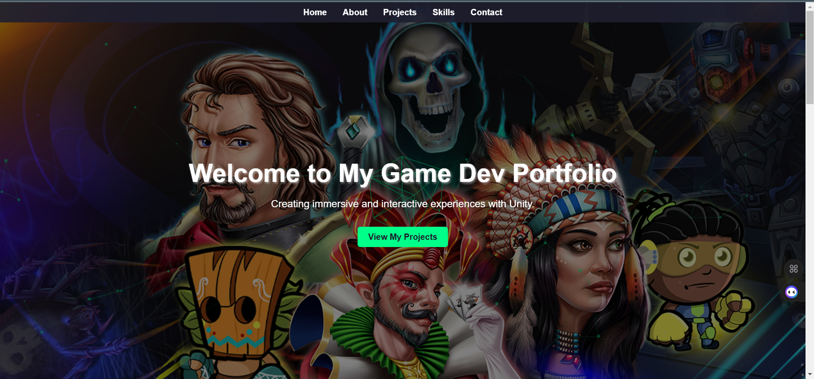
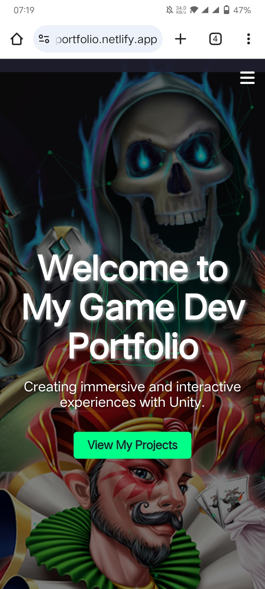

# Taimoor's Portfolio

 <!-- Add a screenshot if available -->

A modern, responsive, and interactive portfolio website built with HTML, CSS, JavaScript, and various libraries like Swiper.js, Particles.js, Three.js, GSAP, and AOS. This project showcases smooth animations, dynamic effects, and a clean design to highlight your skills, projects, and contact information.

## Features

- **Smooth Scrolling**: Navigation links smoothly scroll to respective sections.
- **Interactive Carousels**: Powered by Swiper.js for project showcases.
- **Particle Effects**: Dynamic background effects using Particles.js.
- **3D Animations**: A rotating 3D cube using Three.js.
- **Scroll Animations**: Animate on scroll (AOS) for a modern feel.
- **Responsive Design**: Fully responsive layout with a mobile-friendly navigation menu.
- **GSAP Animations**: Smooth animations for text and buttons.
- **Back to Top Button**: Easy navigation to the top of the page.
- **Contact Form**: A simple form for user inquiries.

## Technologies Used

- **HTML5**: Structure of the website.
- **CSS3**: Styling and animations.
- **JavaScript**: Interactivity and dynamic effects.
- **Swiper.js**: For carousel sliders.
- **Particles.js**: For background particle effects.
- **Three.js**: For 3D animations.
- **GSAP (GreenSock Animation Platform)**: For advanced animations.
- **AOS (Animate On Scroll)**: For scroll-triggered animations.

## Installation

To run this project locally, follow these steps:

### Clone the repository:
```bash
git clone https://github.com/taimoorsiddique13/Unity-Portfolio.git
```

### Navigate to the project directory:
```bash
cd Unity-Portfolio
```

### Open the project:
Open the `index.html` file in your browser.

**Optional**: If you want to modify or extend the project, ensure you have a live server (e.g., VS Code Live Server) to test changes.

## Usage

### Navigation
- Click on the navigation links to smoothly scroll to different sections of the page.
- On mobile devices, click the menu icon to toggle the navigation overlay.

### Projects Section
- Swipe through project carousels or use the navigation buttons to view different projects.

### Contact Form
- Fill out the form to send a message (currently a static form; backend integration can be added).

### Back to Top
- Click the "Back to Top" button to return to the top of the page.

## Customization

You can easily customize this project to fit your needs:

### Update Content:
- Replace the text, images, and links in the `index.html` file with your own content.

### Change Colors:
- Modify the color scheme in the `styles.css` file.

### Add More Sections:
- Add new sections to the HTML file and style them in the CSS file.

### Integrate Backend:
- Connect the contact form to a backend service (e.g., Formspree, Node.js, or PHP).

## Live Demo
https://taimoors-portfolio.netlify.app/

## Screenshots

### Desktop View
 <!-- Add a screenshot -->

### Mobile View
 <!-- Add a screenshot -->

## Contributing

Contributions are welcome! If you'd like to contribute, please follow these steps:

1. Fork the repository.
2. Create a new branch (`git checkout -b feature/YourFeatureName`).
3. Commit your changes (`git commit -m 'Add some feature'`).
4. Push to the branch (`git push origin feature/YourFeatureName`).
5. Open a pull request.

## License

This project is licensed under the MIT License. See the `LICENSE` file for details.

## Acknowledgments

- Swiper.js for the carousel functionality.
- Particles.js for the background effects.
- Three.js for 3D animations.
- GSAP for advanced animations.
- AOS for scroll animations.

## Contact

If you have any questions or feedback, feel free to reach out:

- **Email**: taimoorulhassansiddique.13@gmail.com
- **GitHub**: [taimoorsiddique13](https://github.com/taimoorsiddique13)
- **LinkedIn**: [Taimoor Siddique](https://www.linkedin.com/in/taimoor-siddique)

Enjoy the project! 🚀

